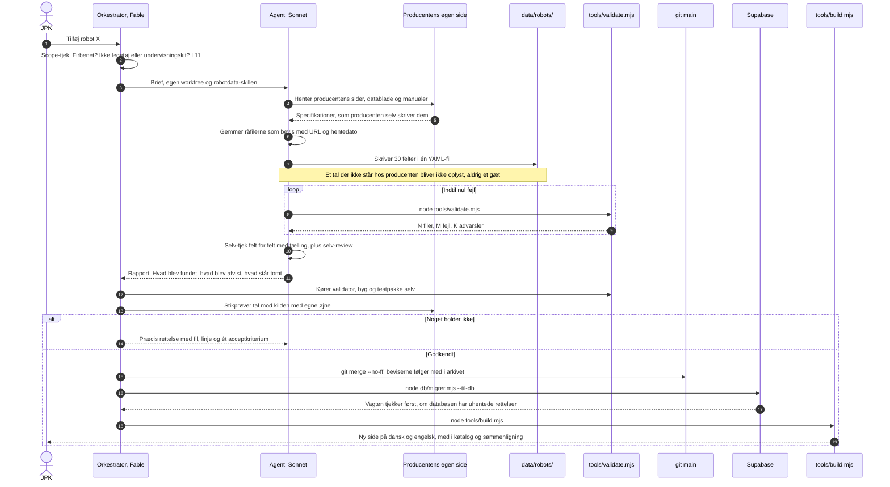
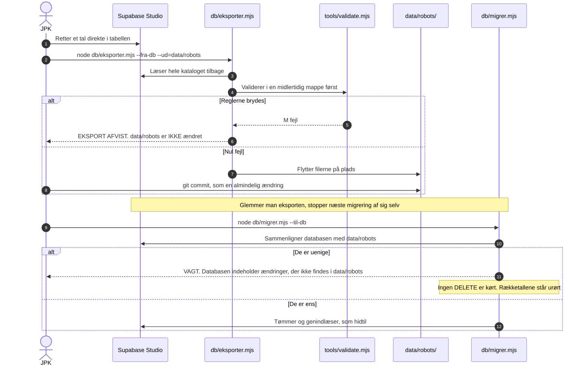
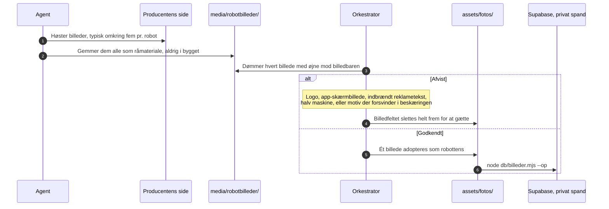

# DATAFLOW.md — vejen et tal går, fra producentens side til den byggede side

Skrevet 25. aug 2026. Dette dokument beskriver **processen**, ikke datamodellen —
tabellerne og felterne står i [db/DIAGRAM.md](db/DIAGRAM.md) og
[DATAMODEL.md](DATAMODEL.md). Reglerne for en enkelt robotpost bor i
`.claude/skills/robotdata/`; her er kun rækkefølgen, og hvem der gør hvad.

Der er **to veje ind i data** siden L35: agenternes vej gennem YAML, og JPK's
vej gennem Supabase Studio. De mødes samme sted — i `data/robots/`, hvor
validatoren står vagt.

---

## 1. En ny robot findes

**Hvorfor agenten og ikke orkestratoren skriver posten:** modelfordelingen i
CLAUDE.md. Orkestratoren planlægger, måler, griller og fletter — den producerer
aldrig selve leverancen. Reviewet går den anden vej: det er altid orkestratorens,
aldrig en Sonnets.

---

## 2. JPK retter et tal i Supabase Studio

**Advarslen der gør vagten nødvendig:** `--til-db` kører tøm-og-genindlæs. Den
er hurtig og genkørselssikker, men den aner ikke, hvad den sletter. Uden vagten
ville én migrering slette en Studio-rettelse uden en eneste fejlmeddelelse.

`--overskriv-databasen` springer vagten over **og kasserer** det, der står i
databasen. Brug den kun, når det er meningen.

---

## 3. Billedvejen — hvorfor 23 robotter står uden foto

**`media/` når aldrig `dist/`.** Der findes ingen kodesti mellem dem, og det er
med vilje: det er den strukturelle håndhævelse af, at fabrikanternes råmateriale
ikke kan slippe ud i en publiceret side. Derfor har råmaterialet også sin **egen**
spand, `arkiv`, adskilt fra sidens egne billeder i `robotbilleder` (L36).

---

## Hvor flowet kan stoppe — og det skal det kunne

Fem porte. Hver enkelt har afvist noget rigtigt:

| Port | Hvad den fanger | Set i praksis |
|---|---|---|
| **Scope** | Robotter, der ikke hører i kataloget | Galileo X afvist — producenten kalder den bevidst ikke firbenet og oplyser nul specifikationer |
| **Validatoren** | Tal uden enhed, kilde eller dato. Enhed af forkert slags. Metrisk mod imperial | Ghost Robotics Vision 60 — 2,4 m/s mod 4,9 mph afviger 9,6 % |
| **Orkestratorens review** | Producenter, der modsiger sig selv | Addverbs specifikationsfane viste Trakr 5's tal under Trakr 20 — 29 felter endte som ikke oplyst frem for tal, vi ikke kunne stole på |
| **Billedbaren** | Billeder, der lyver om hvad de viser | Otte afvist ved billedporten, bl.a. samme foto brugt til en robot på 12 kg og en på 53 kg |
| **Vagten** | En migrering, der ville slette uhentede Studio-rettelser | Efterprøvet 25. aug — afvisningen kom, og 77 robotter, 2.310 feltposter og 54 billeder stod urørt |

En port, der aldrig afviser noget, er ikke en port. Derfor tælles afvisningerne.

---

## Status, 25. aug 2026

Dokumentet beskriver flowet, som det er bygget, og **alt i de tre diagrammer er
nu flettet og efterprøvet** (samme dag, senere): validatorens 18 regler,
agenternes worktree-kæde, orkestratorens review, vagten i `--til-db` (L35),
eksportens egen validering-før-flytning i diagram 2 (`EKSPORT AFVIST` ved
regelbrud, målmappen urørt — bevist med en R5-overtrædelse lagt direkte i
databasen), den private billedspand og arkivspanden (L36, 770 filer oppe,
770 af 770 SHA-identiske ved rundtur).

Én ting er stadig manuel, med vilje: **intet lytter på databasen.** En
Studio-rettelse bliver først synlig på siden, når nogen kører eksport, commit
og byg — se afsnittet ovenfor om, hvorfor den statiske side er et valg og
ikke en forglemmelse.

Kataloget stod ved skrivetidspunktet på **77 robotter, 1.110 kildebelagte tal
og 213 sider**.
