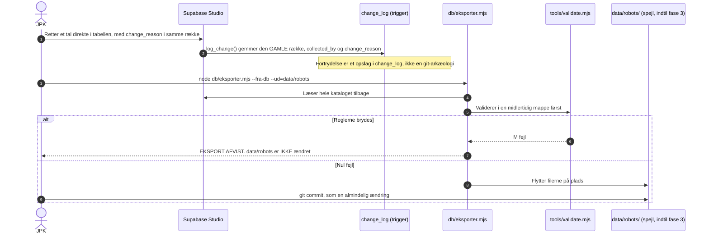
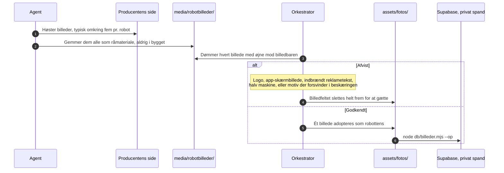

# DATAFLOW.md — vejen et tal går, fra producentens side til den byggede side

Skrevet 25. aug 2026, skrevet om 2. sep 2026 efter fase 1 af
[PLAN.md](PLAN.md) §0. Dette dokument beskriver **processen**, ikke datamodellen —
tabellerne og felterne står i [db/DIAGRAM.md](db/DIAGRAM.md) og
[DATAMODEL.md](DATAMODEL.md). Reglerne for en enkelt robotpost bor i
`.claude/skills/robotdata/`; her er kun rækkefølgen, og hvem der gør hvad.

**Der er én sandhedskilde siden L81: Supabase-databasen, på engelsk (L82).**
Indtil 2. sep 2026 stod her, at der var *to veje ind i data* — agenternes vej
gennem YAML og JPK's vej gennem Studio — som mødtes i `data/robots/`. Den første
vej findes ikke længere: `db/migrer.mjs --til-db` og dens vagt er slettet, og
intet skriver længere fra YAML til databasen. `data/robots/` er i dag et
**genereret spejl** af databasen, som bygget stadig læser, indtil fase 3 lader
`tools/build.mjs` læse databasen direkte — og så forsvinder mappen.

---

## 1. En ny robot findes — eller et tekstfelt geninsamles (fase 2)

```mermaid
sequenceDiagram
    autonumber
    actor JPK
    participant O as Orkestrator, Fable
    participant A as Agent, Sonnet
    participant P as Producentens egen side
    participant S as Supabase, engelsk skema
    participant T as db/tjek.mjs
    participant Y as data/robots/ (spejl, indtil fase 3)
    participant V as tools/validate.mjs
    participant G as git main
    participant B as tools/build.mjs

    JPK->>O: Tilføj robot X, eller: geninsaml tekstfelterne hos producent Z
    O->>O: Scope-tjek. Firbenet? Ikke legetøj eller undervisningskit? L11
    O->>A: Brief med RÆKKEEJERSKAB (én producent pr. spor) og robotdata-skillen
    A->>P: Henter producentens sider, datablade og manualer — på deres eget sprog
    P-->>A: Specifikationer, som producenten selv skriver dem
    A->>A: Gemmer råfilerne som bevis med URL og hentedato (MANIFEST, L83)
    A->>S: Skriver rækker med source_wording ORDRET, collected_by og change_reason
    Note over A,S: Et tal der ikke står hos producenten bliver not_stated, aldrig et gæt.<br/>I fase 2 rører sporet KUN tekstkolonner — tallene består (Å116)
    S->>S: CHECK-begrænsninger afviser ulovlige værdier; log_change() gemmer den gamle række

    loop Indtil tjek består
        A->>T: node db/tjek.mjs
        T->>S: Læser hele kataloget tilbage (kun læsning)
        T->>V: Validerer eksporten i en midlertidig mappe
        T-->>A: N/N dybt lig · M fejl · sider og kildetal
    end

    A->>A: Selv-tjek felt for felt med tælling, plus selv-review
    A-->>O: Rapport, højst 60 linjer, konfidens pr. punkt

    O->>T: Kører tjek, byg og testpakke selv
    O->>P: Stikprøver tekst mod kilden med egne øjne
    O->>S: Numerisk diff mod før sporet — SKAL være 0 i fase 2

    alt Noget holder ikke
        O-->>A: Præcis rettelse med fil, linje og ét acceptkriterium
    else Godkendt
        O->>Y: node db/eksporter.mjs --fra-db --ud=data/robots (indtil fase 3)
        O->>G: git merge --no-ff, beviserne følger med i arkivet
        O->>B: node tools/build.mjs
        B-->>JPK: Ny side, med i katalog og sammenligning
    end
```

**Hvorfor agenten og ikke orkestratoren skriver posten:** modelfordelingen i
CLAUDE.md. Orkestratoren planlægger, måler og fletter — den producerer aldrig
selve leverancen. Reviewet går den anden vej: det er altid orkestratorens,
aldrig en Sonnets.

**Hvorfor sporet skriver direkte i databasen og ikke i en fil:** fordi det er
dér, sandheden bor (L81), og fordi databasen selv holder to ting, en fil ikke
kan: CHECK-begrænsningerne afviser en ulovlig værdi i samme sekund, og
`change_log` gemmer den gamle række med hvem og hvorfor — fortrydelsesknappen,
som ingen YAML-diff nogensinde gav.

---

## 2. JPK retter et tal i Supabase Studio



**Det, der ikke længere kan ske:** før 2. sep 2026 kørte `--til-db`
tøm-og-genindlæs fra YAML, og en glemt eksport betød, at næste migrering ville
slette en Studio-rettelse. Derfor stod en vagt foran den. Nu findes hverken
vejen eller vagten: intet skriver fra YAML til databasen, så en Studio-rettelse
kan ikke overskrives af en fil. Den kan kun overskrives af en anden rettelse —
og den efterlader sit spor i `change_log`.

**Efter fase 3 forsvinder trin 4–9 helt:** bygget læser databasen direkte, og
en Studio-rettelse er synlig ved næste byg uden eksport og uden commit.

---

## 3. Billedvejen — hvorfor 23 robotter står uden foto



**`media/` når aldrig `dist/`.** Der findes ingen kodesti mellem dem, og det er
med vilje: det er den strukturelle håndhævelse af, at fabrikanternes råmateriale
ikke kan slippe ud i en publiceret side. Derfor har råmaterialet også sin **egen**
spand, `arkiv`, adskilt fra sidens egne billeder i `robotbilleder` (L36).

---

## Hvor flowet kan stoppe — og det skal det kunne

Fem porte. Hver enkelt har afvist noget rigtigt:

| Port | Hvad den fanger | Set i praksis |
|---|---|---|
| **Scope** | Robotter, der ikke hører i kataloget | Galileo X afvist — producenten kalder den bevidst ikke firbenet og oplyser nul specifikationer |
| **Validatoren** | Tal uden enhed, kilde eller dato. Enhed af forkert slags. Metrisk mod imperial | Ghost Robotics Vision 60 — 2,4 m/s mod 4,9 mph afviger 9,6 % |
| **Orkestratorens review** | Producenter, der modsiger sig selv | Addverbs specifikationsfane viste Trakr 5's tal under Trakr 20 — 29 felter endte som ikke oplyst frem for tal, vi ikke kunne stole på |
| **Billedbaren** | Billeder, der lyver om hvad de viser | Otte afvist ved billedporten, bl.a. samme foto brugt til en robot på 12 kg og en på 53 kg |
| **Tjek** | En database, der ikke længere kan bygges til den side, den beskriver — eksporten validerer i en midlertidig mappe, før én fil flyttes | 2. sep 2026 (Å115): eksporten gav **70** R18-fejl, fordi `billede.alt` lå som tekst i stedet for sprogkort — fanget før fase 1, rettet med én migrering, og `data/robots/` stod urørt |

En port, der aldrig afviser noget, er ikke en port. Derfor tælles afvisningerne.

Vagten foran `--til-db` stod her som femte port indtil 2. sep 2026. Den afviste
én gang rigtigt (25. aug: 77 robotter, 2.310 feltposter og 54 billeder stod
urørt), og så blev vejen, den vogtede, fjernet. En port foran en dør, der ikke
findes, tælles ikke med.

---

## Status, 2. sep 2026

**Fase 1 er anvendt og efterprøvet.** Den levende database er engelsk
(migrering `engelsk_skema_l81_l83`): 6 tabeller, 78 kolonner og 5 enum-typer
omdøbt, datavaerdier oversat, `change_log` med trigger på de fem skrivbare
tabeller, `collected_by`/`change_reason` på hver af dem, `synk_aftryk` droppet.
Efterprøvet af orkestratoren mod den levende instans: forkontrol 13 af 13 tal,
efterkontrol 17 af 17, og `db/tjek.mjs` gav **77/77 dybt lig · 0 fejl ·
216=216 sider · 1111=1111 kildebelagte tal** (Å125).

**Det, der stadig er midlertidigt, med vilje:**

- `data/robots/` læses fortsat af bygget. Det er et spejl, og `db/tjek.mjs`
  beviser, at spejlet og databasen siger det samme. Fase 3 fjerner spejlet.
- `db/eksporter.mjs` oversætter engelske kolonner tilbage til den danske
  YAML-form gennem `db/ordbog.mjs`. Ordbogen er en overgangsting (L85) og
  forsvinder i fase 5, når koden selv bliver engelsk.
- `field_definitions` (33 rækker) er en **håndholdt kopi** af
  `tools/skema.mjs`: efter `migrer.mjs` blev slettet, skriver intet den
  længere (Å123). Ændres skemaet, skal begge steder rettes.
- **Intet lytter på databasen.** En Studio-rettelse bliver først synlig på
  siden, når nogen kører eksport, commit og byg — indtil fase 3.

Kataloget stod ved skrivetidspunktet på **77 robotter, 1.111 kildebelagte tal
og 216 sider**.
