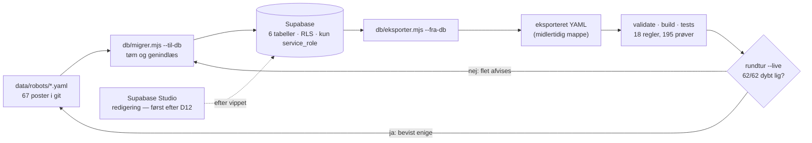
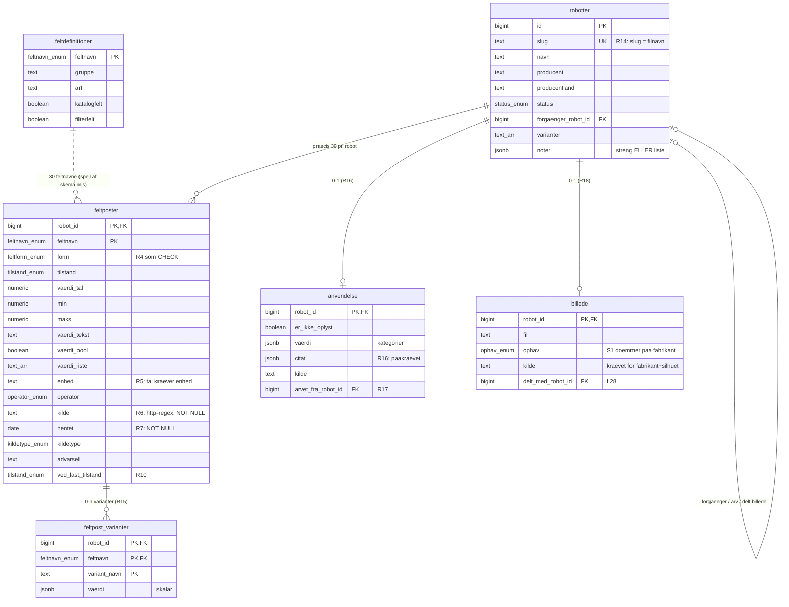

# Robotkatalogets datamodel — diagram

Læsebillede af [skema.sql](skema.sql), som er sandheden. Genereret 25. aug 2026 til
planlægning (L34/D12). Ændrer skemaet sig, skal denne fil følge med — eller slettes.

## Kredsløbet — sådan bevæger sandheden sig

Indtil D12-vippet er YAML-filerne den arbejdende sandhed; databasen er et efterprøvet
spejl. Rundturen er beviset: alt, der migreres ind, skal komme identisk ud igen.

Målt 25. aug 2026: live-rundtur 62/62 · validate 0 fejl · build 173=173 sider ·
857=857 kildebelagte tal. Filerne er siden vokset til 67 poster; databasen
genmigreres, når kand5 og lysbyg er flettet.

## ER-diagram — de seks tabeller

Alt hænger på `robotter.id` med kaskadesletning. Fravær af en række er information:
ingen billede-række betyder måleplade, ingen anvendelse-række betyder at topnøglen
ikke findes i YAML'en.

Rækketal efter fuld migrering af 67 poster: robotter 67 · feltposter 2.010 ·
varianter 127 · anvendelse 66 · billede 54 · feltdefinitioner 30.

## De syv enum-typer

| Enum | Værdier |
|---|---|
| `tilstand_enum` | ikke_oplyst · nej · kun_billede — 0 er strukturelt et tal, aldrig en tilstand |
| `feltform_enum` | bare_tilstand · tilstand_med_herkomst · tal · interval · tekst · bool · liste |
| `feltnavn_enum` | de 30 feltnavne — et ukendt felt kan ikke indsættes |
| `status_enum` | i_produktion · annonceret · udgaaet · demonstrator |
| `kildetype_enum` | primaer · sekundaer |
| `operator_enum` | > · >= · < · <= · ~ · ± |
| `ophav_enum` | eget_foto · silhuet · fabrikant |

## Hvem fanger hvad

| Lag | Håndhæver |
|---|---|
| **Databasen selv** | enums, NOT NULL, FK'er · R4 (værdi XOR interval, CHECK) · R5 (tal kræver enhed) · R6/R7 (kilde-URL + hentedato på alt undtagen bar tilstand) · R16 (kategori kræver ordret citat) |
| **Migrering + validate** | R15 (variantnavn i robottens egen liste) · hele R17-arven (kræver opslag i moderens række) · enhedens dimension · R18's stiregler + fil-findes-på-disk |
| **Build + drift** | S1 (`--til-udgivelse` afviser fabrikant-billeder) · nævneren udledes af skemaet (L30) · RLS uden policies: kun service_role, nøglen i gitignoreret `.env` |
