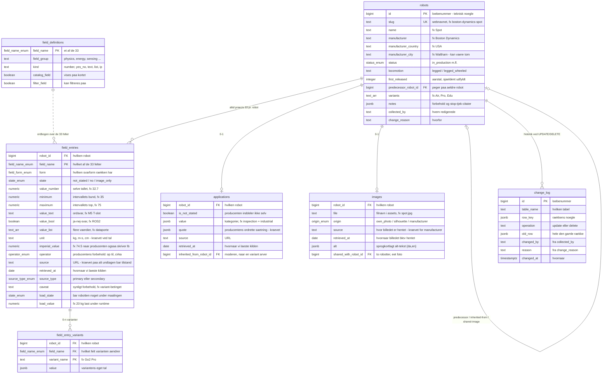

# Robotkatalogets datamodel — lavpraktisk forklaret

Læsebillede af [skema.sql](skema.sql), som er sandheden. Opdateret 2. sep 2026
(spor/skema, L81-L83 — engelsk skema, 77 robotter, 33 felter, `change_log`
i stedet for `synk_aftryk`). Ændrer skemaet sig, skal denne fil følge med —
eller slettes.

---

## Det store billede på 30 sekunder

Databasen svarer på ét spørgsmål: **"Hvad ved vi om hver robot, og hvor ved vi det fra?"**

- Én række i `robots` = én robot (fx Spot).
- Hver robot har **altid præcis 33 rækker** i `field_entries` — én pr.
  specifikation. Også når svaret er "det oplyser producenten ikke". Sådan
  kan udfyldningsgraden regnes: udfyldte felter ud af 33.
- Billede og anvendelse (`images`/`applications`) er **0 eller 1 række** pr.
  robot — findes rækken ikke, er det i sig selv et svar (intet billede =
  måleplade vises i stedet).
- Enhver UPDATE/DELETE på en af de fem skrivbare tabeller logges i
  `change_log` — fortrydelsesknappen (se afsnittet nedenfor).

**Kolonnenavnene er engelske** (L81-L83 punkt 3 i STATUS.md); den ENE
dansk↔engelsk-ordbog, der afgjorde hvert navn, er [ordbog.mjs](ordbog.mjs).
Kommentarerne i `skema.sql` forbliver danske — L82 gælder databasens
identifikatorer og indhold, ikke dokumentationens sprog.

---

## ER-diagrammet

### Sådan læses stregerne (kragefods-notation)

Hver **ende** af en streg fortæller, hvor mange rækker på dén side der kan deltage —
læs de to ender hver for sig:

| Endesymbol | Betyder |
|---|---|
| to lodrette streger | præcis én |
| cirkel + streg | nul eller én ("kan mangle") |
| cirkel + kragefod | nul eller mange |
| streg + kragefod | én eller mange |

Cirklen betyder altid *kan mangle*; kragefoden (de tre tæer) betyder altid *mange*.
Fuldt optrukket streg = ægte ejerskab (slettes robotten, ryger rækkerne med);
stiplet streg = løst opslag (ordbogen `field_definitions` ejer ikke
`field_entries`, den slås bare op i). Eksempel: `robots ||--o| images` læses
"én robot har nul eller ét billede" — cirklen ER måleplade-fallbacken.

---

## Enum-opslagsværket — alle syv lister, alle værdier

En enum er en **lukket liste af lovlige værdier** — som en dropdown, hvor man ikke
kan skrive frit. Prøver man at indsætte noget uden for listen, nægter databasen.
Pointen: stavefejl og hjemmelavede kategorier er strukturelt umulige.

### 1. `state_enum` — de ærlige ikke-tal-svar

Det vigtigste begreb i kataloget. Når vi spørger "hvad vejer robotten?", findes
der fire slags svar, som ALDRIG må blandes sammen (hård begrænsning 5):

| Svaret | Gemmes som | Betyder | Eksempel |
|---|---|---|---|
| et tal, fx `32.7` | talkolonne | producenten oplyser tallet | Spots egenvægt: 32,7 kg |
| `0` | talkolonne | producenten oplyser tallet NUL — et rigtigt svar | 0 kr. i licens |
| `not_stated` | enum | producenten siger ingenting — et hul | ANYmal X' vægt |
| `no` | enum | producenten siger udtrykkeligt "det har den ikke" | "ingen dockingstation" |
| `image_only` | enum | oplysningen findes kun som billede/tegning hos producenten | bruges sjældent |

Katalogsider "lyver" typisk ved at vise et hul som et nul eller omvendt. Denne
database KAN ikke blande dem: 0 er et tal i talkolonnen, resten er enum-værdier
i state-kolonnen.

### 2. `field_form_enum` — hvilken svarform har rækken?

| Værdi | Betyder | Eksempel |
|---|---|---|
| `number` | ét tal med enhed | fart: 1,6 m/s |
| `interval` | fra-til | højde: 35-75 cm (Keyper) |
| `text` | ord, ikke tal | "M5 T-slot-skinner" |
| `bool` | ja/nej-svar | ROS 2: ja |
| `list` | flere værdier | dataporte: Ethernet, USB, RS485 |
| `bare_state` | kun en tilstand, ingen kilde krævet | `not_stated` |
| `state_with_provenance` | en tilstand MED kilde | et "no" producenten selv har skrevet, med URL |

### 3. `field_name_enum` — de 33 felter

**Physics:** `weight` · `length` · `width` · `height` · `degrees_of_freedom` ·
`payload_walking` · `payload_standing` · `speed` · `slope` ·
`obstacle_single` · `stair_step_continuous` · `ip_rating` · `temperature_min` · `temperature_max`

**Energy:** `battery_wh` · `runtime` · `hot_swap` · `charging_time` · `docking_station`

**Sensing:** `lidar` · `cameras` · `compute` · `ros2` · `sdk_languages` · `autonomy_level`

**Payload:** `mounting_interface` · `power_output` · `data_ports`

**Commercial:** `price`

**Regulatory:** `ce_disclosed` · `fcc_disclosed` · `ul_disclosed` · `ccc_disclosed`

Låst liste = ingen kan opfinde et 34. felt ved en stavefejl. Ændres listen, er
det en beslutning med L-nummer i STATUS.md, ikke et skred.

### 4. `status_enum` — robottens livsstatus

| Værdi | Betyder | Eksempel |
|---|---|---|
| `in_production` | kan købes/lejes nu | Spot, Go2 |
| `announced` | vist af producenten, men ikke i handel | Shvana |
| `discontinued` | historisk, ikke længere solgt | Laikago |
| `demonstrator` | forskningsplatform, aldrig et produkt | (reserveret) |

### 5. `source_type_enum` — hvor tæt på producenten er kilden?

| Værdi | Betyder |
|---|---|
| `primary` | selve produktsiden på producentens domæne |
| `secondary` | producentens ØVRIGE eget materiale: PDF-datablad, manual, egen GitHub (L33) |

### 6. `operator_enum` — producentens egne forbeholdstegn

| Værdi | Læses som |
|---|---|
| `>` | mere end |
| `>=` | mindst |
| `<` | under |
| `<=` | op til |
| `~` | cirka |
| `±` | plus/minus |

Symboler, sprogneutrale — uændrede af L82.

### 7. `origin_enum` — hvor kommer billedet fra?

| Værdi | Betyder | Konsekvens |
|---|---|---|
| `own_photo` | vores eget kamera | frit at bruge, ingen kilde krævet |
| `silhouette` | vores måltro tegning | kilde krævet (måltallene skal kunne følges) |
| `manufacturer` | producentens pressefoto | kilde krævet. SPÆRRING S1 er ophævet (L37, 26. aug 2026) — ingen build-blokering længere |

---

## Tabellerne, felt for felt

### `robots` — én række pr. robot

Identitetsfelterne (`slug`, `name`, `manufacturer`, `manufacturer_country`,
`manufacturer_city`, `status`, `locomotion`, `first_released`,
`predecessor_robot_id`, `variants`, `notes`) — producenter er IKKE en egen
tabel, de udledes af robotterne. `locomotion` (`legged`/`legged_wheeled`)
IKKE "propulsion" — se `ordbog.mjs`.

### `field_entries` — 33 rækker pr. robot (77 × 33 = 2.541)

`form` styrer via CHECK, hvilke værdikolonner der SKAL/MÅ udfyldes.
`caveat_class` er engelsk KOLONNE med DANSK INDHOLD ("gyldighed"/"uddybning")
— bevidst afgrænsning, se `skema.sql`s kommentar ved kolonnen.

### `field_entry_variants` — når ét felt har flere tal

Go2 findes i fire udgaver; nyttelasten falder fra 5 til 2,5 kg hen over dem.

### `applications` — hvad producenten SELV siger, robotten er til

`value`/`quote` — KUN producentens egen inddeling, aldrig vores mening.
Tæller bevidst IKKE i udfyldningsgraden.

### `images` — robottens foto (0 eller 1)

`alt` er `jsonb` (sprogkort `{da, en}`) siden L81 punkt 3.
`shared_with_robot_id`: to robotter kan dele ét foto (L28).

### `field_definitions` — ordbogen over de 33 felter

Maskinskrevet kopi af `tools/skema.mjs` (genskrives ved hver `--til-db`,
aldrig håndredigeret). IKKE omfattet af `collected_by`/`change_reason` — den
er aldrig en Studio-redigering, et menneske skal forklare.

### `change_log` — fortrydelsesknappen (L81-L83 punkt 3)

Erstatter `synk_aftryk`. Fyldt af trigger `log_change()` ved UPDATE/DELETE
på de fem skrivbare tabeller. `changed_by`/`reason` kommer fra rækkens egen
`collected_by`/`change_reason` (NEW ved UPDATE, OLD ved DELETE).

---

*Kilde: `db/skema.sql` + `db/ordbog.mjs` + `fund/FUND-skema.md`.*
