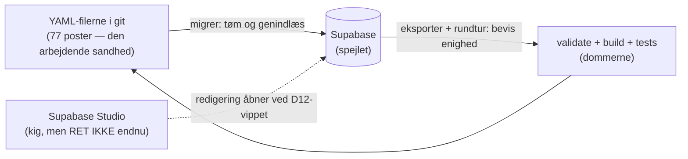

# Robotkatalogets datamodel — lavpraktisk forklaret

Læsebillede af [skema.sql](skema.sql), som er sandheden. Opdateret 25. aug 2026
(77 poster). Ændrer skemaet sig, skal denne fil følge med — eller slettes.

---

## Det store billede på 30 sekunder

Databasen svarer på ét spørgsmål: **"Hvad ved vi om hver robot, og hvor ved vi det fra?"**

- Én række i `robotter` = én robot (fx Spot).
- Hver robot har **altid præcis 30 rækker** i `feltposter` — én pr. specifikation
  (vægt, fart, IP-klasse …). Også når svaret er "det oplyser producenten ikke".
  Det er sådan, vi kan regne udfyldningsgrad: udfyldte felter ud af 30.
- Billede og anvendelse er **0 eller 1 række** pr. robot — findes rækken ikke,
  er det i sig selv et svar (intet billede = måleplade vises i stedet).

```mermaid
erDiagram
  robotter ||--o{ feltposter : "altid praecis 30 pr. robot"
  feltposter ||--o{ feltpost_varianter : "0-n varianter"
  robotter ||--o| anvendelse : "0-1"
  robotter ||--o| billede : "0-1"
  robotter |o--o| robotter : "forgaenger / arv / delt billede"
  feltdefinitioner ||..o{ feltposter : "ordbogen over de 30 felter"

  robotter {
    bigint id PK "loebenummer - teknisk noegle"
    text slug UK "webnavnet, fx boston-dynamics-spot"
    text navn "fx Spot"
    text producent "fx Boston Dynamics"
    text producentland "fx USA"
    text producentby "fx Waltham - kan vaere tom"
    status_enum status "i_produktion m.fl."
    integer foerste_udgivelse "aarstal, kun 3 af 77"
    bigint forgaenger_robot_id FK "peger paa aeldre robot"
    text_arr varianter "fx Air, Pro, Edu"
    jsonb noter "forbehold og stop-tjek-citater"
  }
  feltposter {
    bigint robot_id PK_FK "hvilken robot"
    feltnavn_enum feltnavn PK "hvilket af de 30 felter"
    feltform_enum form "tal, interval, tekst, bool, liste eller tilstand"
    tilstand_enum tilstand "ikke_oplyst / nej / kun_billede"
    numeric vaerdi_tal "selve tallet, fx 32.7"
    numeric min "intervallets bund, fx 35"
    numeric maks "intervallets top, fx 75"
    text vaerdi_tekst "ordsvar, fx M5 T-slot"
    boolean vaerdi_bool "ja-nej-svar, fx ROS2"
    text_arr vaerdi_liste "flere vaerdier, fx dataporte"
    text enhed "kg, m-s, cm - kraevet ved tal"
    numeric vaerdi_imperial "fx 74.5 naar producenten ogsaa skriver lb"
    operator_enum operator "producentens forbehold: op til, cirka"
    text kilde "URL - kraevet paa alt undtagen bar tilstand"
    date hentet "hvornaar vi laeste kilden"
    kildetype_enum kildetype "primaer eller sekundaer"
    text advarsel "synligt forbehold, fx variant-betinget"
    tilstand_enum ved_last_tilstand "bar robotten noget under maalingen"
    numeric ved_last_vaerdi "fx 20 kg last under driftstiden"
  }
  feltpost_varianter {
    bigint robot_id PK_FK ""
    feltnavn_enum feltnavn PK_FK "hvilket felt varianten aendrer"
    text variant_navn PK "fx Go2 Pro"
    jsonb vaerdi "variantens eget tal"
  }
  anvendelse {
    bigint robot_id PK_FK ""
    boolean er_ikke_oplyst "producenten inddeler ikke selv"
    jsonb vaerdi "kategorier, fx inspektion + industri"
    jsonb citat "producentens ordrette saetning - kraevet"
    text kilde "URL"
    date hentet ""
    bigint arvet_fra_robot_id FK "moderen, naar en variant arver"
  }
  billede {
    bigint robot_id PK_FK ""
    text fil "filnavn i assets, fx spot.jpg"
    ophav_enum ophav "eget_foto / silhuet / fabrikant"
    text kilde "hvor billedet er hentet - kraevet for fabrikant"
    date hentet ""
    text alt "alt-tekst til sitet"
    bigint delt_med_robot_id FK "to robotter, eet foto"
  }
  feltdefinitioner {
    feltnavn_enum feltnavn PK "et af de 30"
    text gruppe "fysik, energi, sensorik ..."
    text art "tal, jaNej, tekst, liste, ip"
    boolean katalogfelt "vises paa kortet"
    boolean filterfelt "kan filtreres paa"
  }
```

---

## Først: hvad er en "enum"?

En enum er bare en **lukket liste af lovlige værdier** — som en dropdown, hvor man
ikke kan skrive frit. Feltet `status` kan fx KUN indeholde ét af fire ord; prøver
man at skrive "coming soon", nægter databasen. Pointen: stavefejl og hjemmelavede
kategorier er umulige.

### De syv lister, oversat til hverdagssprog

**1. Robottens fire svar-tilstande** (`tilstand_enum` + tal)

Det vigtigste begreb i hele kataloget. Når vi spørger "hvad vejer robotten?",
findes der fire slags svar, og de må ALDRIG blandes sammen:

| Svaret | Betyder | Eksempel |
|---|---|---|
| et tal, fx `32.7` | Producenten oplyser tallet | Spots egenvægt: 32,7 kg |
| `0` | Producenten oplyser tallet NUL — det er et rigtigt svar | 0 kr. i licensomkostning |
| `nej` | Producenten siger udtrykkeligt "det har den ikke" | "Ingen dockingstation" |
| `ikke_oplyst` | Producenten siger ingenting — et hul | ANYmal X' vægt: intet svar |
| `kun_billede` | Oplysningen findes kun som billede/tegning hos producenten — vi kan se den, men ikke citere et tal | (bruges sjældent) |

Hvorfor det betyder noget: katalogsider "lyver" typisk ved at vise et hul som et
nul eller omvendt. Vores database KAN ikke blande dem — 0 gemmes som tal,
de andre som enum-værdi i en anden kolonne.

**2. Feltets form** (`feltform_enum`) — *hvilken slags svar står der i rækken?*

| Form | Betyder | Eksempel |
|---|---|---|
| `tal` | ét tal med enhed | fart: 1,6 m/s |
| `interval` | fra-til | højde: 35-75 cm (Keyper) |
| `tekst` | ord, ikke tal | "M5 T-slot-skinner" |
| `bool` | ja/nej-svar | ROS 2: ja |
| `liste` | flere værdier | dataporte: Ethernet, USB, RS485 |
| `bare_tilstand` | kun en tilstand, ingen kilde krævet | `ikke_oplyst` |
| `tilstand_med_herkomst` | en tilstand MED kilde — fx et "nej", producenten selv har skrevet, med link til hvor | "nej" + URL |

Hvorfor: formen styrer, hvilke kolonner der SKAL og MÅ være udfyldt. Et "tal"
uden enhed afvises. En "tilstand" med en enhed afvises. Reglerne håndhæves af
databasen selv, ikke af, om nogen husker dem.

**3. De 30 feltnavne** (`feltnavn_enum`) — egenvaegt, laengde, hastighed, ip_klasse
osv. Låst liste = ingen kan opfinde et 31. felt ved en stavefejl ("egenvægt" med
ø ville blive afvist). Ændres skemaet (fx D11-trimmen), er det en beslutning med
L-nummer, ikke et skred.

**4. Robottens livsstatus** (`status_enum`): `i_produktion` (kan købes/lejes nu) ·
`annonceret` (vist, men ikke i handel) · `udgaaet` (historisk, fx Laikago) ·
`demonstrator` (forskningsplatform, aldrig et produkt).

**5. Kildens art** (`kildetype_enum`): `primaer` = selve produktsiden ·
`sekundaer` = producentens ØVRIGE materiale (PDF-datablad, manual, egen GitHub).
Aldrig presse eller forhandlere — de kan slet ikke gemmes. Sekundære kilder
markeres synligt (L33).

**6. Forbeholdstegn** (`operator_enum`): når producenten selv skriver "op til
5 m/s" eller "~120 min", gemmer vi tegnet (`<=`, `~`, `±` …) sammen med tallet.
Hvorfor: at slette forbeholdet ville gøre producentens cirka-tal til vores
præcise påstand.

**7. Billedets ophav** (`ophav_enum`): `eget_foto` (vores kamera — frit at bruge) ·
`silhuet` (vores måltro tegning) · `fabrikant` (producentens pressefoto — må KUN
bruges lokalt; S1-spærringen nægter at bygge til udgivelse, så længe de findes).

---

## Tabellerne, felt for felt

### `robotter` — én række pr. robot

| Kolonne | Hvad står der | Hvorfor findes den |
|---|---|---|
| `id` | et løbenummer, databasen selv finder på | teknisk nøgle, som de andre tabeller peger på |
| `slug` | robottens webnavn, fx `boston-dynamics-spot` | matcher filnavnet i git og URL'en på sitet — menneskets nøgle |
| `navn`, `producent`, `producentland`, `producentby` | identiteten | producenter er IKKE en egen tabel — de udledes af robotterne, som sitet altid har gjort |
| `status` | de fire livstilstande ovenfor | så kataloget kan skelne købbart fra historisk |
| `foerste_udgivelse` | årstal | kun når producenten selv oplyser det (3 af 77) |
| `forgaenger_robot_id` | peger på en ÆLDRE robot i samme tabel | fx "afløser Honey Badger 4.0" |
| `varianter` | navneliste, fx Go2 Air/Pro/Edu | når ét produktnavn dækker flere udgaver med hver sine tal |
| `noter` | fritekst-forbehold | modsigelser i producentens eget materiale, stop-tjek-citater osv. |

### `feltposter` — 30 rækker pr. robot (77 × 30 = 2.310)

| Kolonne | Hvad står der | Hvorfor findes den |
|---|---|---|
| `robot_id` + `feltnavn` | hvem + hvilket felt | tilsammen nøglen: der kan aldrig være to vægt-rækker for Spot |
| `form` | hvilken svarform (se enum 2) | styrer resten af rækken via databasens egne tjek |
| `tilstand` | ikke_oplyst / nej / kun_billede | de ærlige ikke-tal-svar |
| `vaerdi_tal` / `min`+`maks` / `vaerdi_tekst` / `vaerdi_bool` / `vaerdi_liste` | selve svaret — KUN én af dem må være udfyldt | R4: "værdi ELLER interval, aldrig begge" er en regel databasen selv håndhæver |
| `enhed` (+ `vaerdi_imperial`) | kg, m/s, cm … | et tal uden enhed er ikke et tal — afvises |
| `operator` | forbeholdstegnet | se enum 6 |
| `kilde` + `hentet` + `kildetype` | URL, dato, primær/sekundær | KRAVET på alt undtagen et rent "ikke_oplyst" — det er hele katalogets troværdighed |
| `advarsel` | synligt forbehold | fx "gælder kun tilkøbt vandtæt variant" (Cyvets IP54) |
| `ved_last_*` | driftstidens lastbetingelse | "90 min" betyder intet uden at vide, om robotten bar noget imens (R10) |

### `feltpost_varianter` — når ét felt har flere tal

Go2 findes i fire udgaver, og nyttelasten falder fra 5 til 2,5 kg hen over dem.
I stedet for at vælge ét tal (og lyve lidt) gemmes alle fire med hver sit
variantnavn. | `variant_navn` = udgavens navn · `vaerdi` = udgavens tal |

### `anvendelse` — hvad producenten SELV siger robotten er til

| Kolonne | Hvad står der | Hvorfor findes den |
|---|---|---|
| `vaerdi` | kategorier (inspektion, industri …) | KUN producentens egen inddeling — aldrig vores mening |
| `citat` | producentens ordrette sætning | uden citatet ville kategorien være vores påstand (R16) |
| `arvet_fra_robot_id` | peger på "moderen" | en W-variant må arve kategorien fra grundmodellen — men det skal stå der, så arv aldrig ligner selvstændig kilde (R17) |

Tæller bevidst IKKE med i udfyldningsgraden — det er identitet, ikke specifikation.

### `billede` — robotens foto (0 eller 1)

| Kolonne | Hvad står der | Hvorfor findes den |
|---|---|---|
| `fil` | filnavnet i assets/ | |
| `ophav` | eget_foto / silhuet / fabrikant | S1: fabrikant-billeder spærrer for udgivelse |
| `kilde` + `hentet` | hvor og hvornår hentet | kræves for fabrikant og silhuet — et billede skal kunne følges til sin side |
| `delt_med_robot_id` | to robotter, ét foto | fx varianter fotograferet sammen (L28) |

Ingen række = robotten vises med sin måleplade i stedet. Det er et ærligt svar,
ikke en fejl.

### `feltdefinitioner` — ordbogen over de 30 felter

Maskinskrevet kopi af `tools/skema.mjs` (genskrives ved hver migrering, aldrig
håndredigeret): hvilken gruppe hvert felt hører til, hvilken svarform det tager,
og om det vises på kort/kan filtreres på. Findes, så en fremtidig redigerings-UI
kan læse skemaet uden at kende projektets JavaScript.

---

## Kredsløbet — hvem må ændre hvad lige nu



Indtil D12-vippet: **redigér aldrig i Studio** — næste migrering overskriver det.
Efter vippet vender pilen: så redigeres der i Studio, og filerne genereres.

---

*Rækketal efter næste migrering: robotter 77 · feltposter 2.310 · billede 54 ·
varianter og anvendelse tælles ved migreringen. Kilde: db/skema.sql +
fund/FUND-db1.md/FUND-db2.md.*
