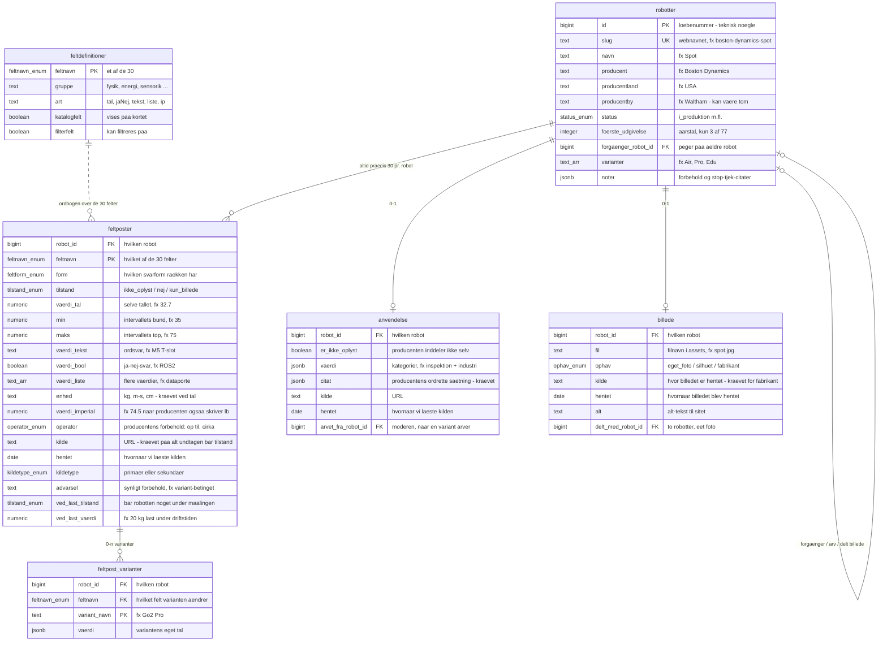
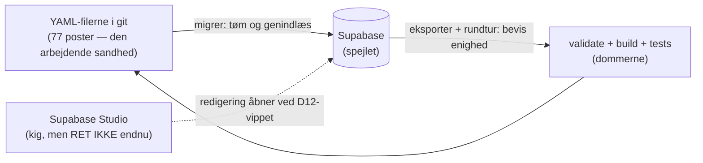

# Robotkatalogets datamodel — lavpraktisk forklaret

Læsebillede af [skema.sql](skema.sql), som er sandheden. Opdateret 25. aug 2026
(77 poster). Ændrer skemaet sig, skal denne fil følge med — eller slettes.

---

## Det store billede på 30 sekunder

Databasen svarer på ét spørgsmål: **"Hvad ved vi om hver robot, og hvor ved vi det fra?"**

- Én række i `robotter` = én robot (fx Spot).
- Hver robot har **altid præcis 30 rækker** i `feltposter` — én pr. specifikation.
  Også når svaret er "det oplyser producenten ikke". Sådan kan udfyldningsgraden
  regnes: udfyldte felter ud af 30.
- Billede og anvendelse er **0 eller 1 række** pr. robot — findes rækken ikke,
  er det i sig selv et svar (intet billede = måleplade vises i stedet).

---

## ER-diagrammet

### Sådan læses stregerne (kragefods-notation)

Hver **ende** af en streg fortæller, hvor mange rækker på dén side der kan deltage —
læs de to ender hver for sig:

| Endesymbol | Betyder |
|---|---|
| to lodrette streger | præcis én |
| cirkel + streg | nul eller én ("kan mangle") |
| cirkel + kragefod | nul eller mange |
| streg + kragefod | én eller mange |

Cirklen betyder altid *kan mangle*; kragefoden (de tre tæer) betyder altid *mange*.
Fuldt optrukket streg = ægte ejerskab (slettes robotten, ryger rækkerne med);
stiplet streg = løst opslag (ordbogen `feltdefinitioner` ejer ikke feltposterne,
den slås bare op i). Eksempel: `robotter ||--o| billede` læses "én robot har nul
eller ét billede" — cirklen ER måleplade-fallbacken.

---

## Enum-opslagsværket — alle syv lister, alle værdier

En enum er en **lukket liste af lovlige værdier** — som en dropdown, hvor man ikke
kan skrive frit. Prøver man at indsætte noget uden for listen, nægter databasen.
Pointen: stavefejl og hjemmelavede kategorier er strukturelt umulige.

### 1. `tilstand_enum` — de ærlige ikke-tal-svar

Det vigtigste begreb i kataloget. Når vi spørger "hvad vejer robotten?", findes
der fire slags svar, som ALDRIG må blandes sammen:

| Svaret | Gemmes som | Betyder | Eksempel |
|---|---|---|---|
| et tal, fx `32.7` | talkolonne | producenten oplyser tallet | Spots egenvægt: 32,7 kg |
| `0` | talkolonne | producenten oplyser tallet NUL — et rigtigt svar | 0 kr. i licens |
| `ikke_oplyst` | enum | producenten siger ingenting — et hul | ANYmal X' vægt |
| `nej` | enum | producenten siger udtrykkeligt "det har den ikke" | "ingen dockingstation" |
| `kun_billede` | enum | oplysningen findes kun som billede/tegning hos producenten — vi kan se den, men ikke citere et tal | bruges sjældent (0 af 77 i dag) |

Katalogsider "lyver" typisk ved at vise et hul som et nul eller omvendt. Denne
database KAN ikke blande dem: 0 er et tal i talkolonnen, resten er enum-værdier
i tilstandskolonnen.

### 2. `feltform_enum` — hvilken svarform har rækken?

| Værdi | Betyder | Eksempel |
|---|---|---|
| `tal` | ét tal med enhed | fart: 1,6 m/s |
| `interval` | fra-til | højde: 35-75 cm (Keyper) |
| `tekst` | ord, ikke tal | "M5 T-slot-skinner" |
| `bool` | ja/nej-svar | ROS 2: ja |
| `liste` | flere værdier | dataporte: Ethernet, USB, RS485 |
| `bare_tilstand` | kun en tilstand, ingen kilde krævet | `ikke_oplyst` |
| `tilstand_med_herkomst` | en tilstand MED kilde | et "nej" producenten selv har skrevet, med URL |

Formen styrer resten af rækken via databasens egne tjek: et `tal` uden enhed
afvises, en tilstand med enhed afvises.

### 3. `feltnavn_enum` — de 30 felter

**Fysik:** `egenvaegt` · `laengde` · `bredde` · `hoejde` · `frihedsgrader` ·
`nyttelast_gaaende` · `nyttelast_staaende` · `hastighed` · `haeldning` ·
`forhindring_enkelt` · `trappetrin_kontinuerlig` · `ip_klasse` · `temp_min` · `temp_maks`

**Energi:** `batteri_wh` · `driftstid` · `hot_swap` · `ladetid` · `dockingstation`

**Sensorik og autonomi:** `lidar` · `kameraer` · `compute` · `ros2` · `sdk_sprog` · `autonominiveau`

**Nyttelast og udvidelser:** `monteringsinterface` · `stroem_ud` · `dataporte`

**Kommercielt:** `pris`

**EU:** `ce_oplyst`

Låst liste = ingen kan opfinde et 31. felt ved en stavefejl ("egenvægt" med ø
afvises). Ændres listen (fx D11-trimmen), er det en beslutning med L-nummer i
STATUS.md, ikke et skred.

### 4. `status_enum` — robottens livsstatus

| Værdi | Betyder | Eksempel |
|---|---|---|
| `i_produktion` | kan købes/lejes nu | Spot, Go2 |
| `annonceret` | vist af producenten, men ikke i handel | Shvana |
| `udgaaet` | historisk, ikke længere solgt | Laikago |
| `demonstrator` | forskningsplatform, aldrig et produkt | (reserveret) |

### 5. `kildetype_enum` — hvor tæt på producenten er kilden?

| Værdi | Betyder |
|---|---|
| `primaer` | selve produktsiden på producentens domæne |
| `sekundaer` | producentens ØVRIGE eget materiale: PDF-datablad, manual, egen GitHub (L33) — markeres synligt på sitet |

Presse, forhandlere og databaser kan slet ikke gemmes — de er ikke lovlige værdier
nogen steder.

### 6. `operator_enum` — producentens egne forbeholdstegn

| Værdi | Læses som | Eksempel fra kataloget |
|---|---|---|
| `>` | mere end | nyttelast "> 40 kg" (B2) |
| `>=` | mindst | |
| `<` | under | |
| `<=` | op til | driftstid "op til 12 t" (MOVENEW T1) |
| `~` | cirka | hastighed "~2-5 m/s" (Shvana) |
| `±` | plus/minus | vægt "± 5,6 kg" (Y10) |

Tegnet gemmes sammen med tallet — at slette det ville gøre producentens cirka-tal
til vores præcise påstand.

### 7. `ophav_enum` — hvor kommer billedet fra?

| Værdi | Betyder | Konsekvens |
|---|---|---|
| `eget_foto` | vores eget kamera | frit at bruge, ingen kilde krævet |
| `silhuet` | vores måltro tegning | kilde krævet (måltallene skal kunne følges) |
| `fabrikant` | producentens pressefoto | kilde krævet — og S1-spærringen nægter at bygge til udgivelse, så længe de findes uden skriftlig tilladelse |

---

## Tabellerne, felt for felt

### `robotter` — én række pr. robot

| Kolonne | Hvad står der | Hvorfor findes den |
|---|---|---|
| `id` | løbenummer, databasen selv finder på | teknisk nøgle, de andre tabeller peger på |
| `slug` | webnavnet, fx `boston-dynamics-spot` | matcher filnavnet i git og URL'en — menneskets nøgle |
| `navn`, `producent`, `producentland`, `producentby` | identiteten | producenter er IKKE en egen tabel — de udledes af robotterne, som sitet altid har gjort |
| `status` | livsstatus (enum 4) | skelner købbart fra historisk |
| `foerste_udgivelse` | årstal | kun når producenten selv oplyser det (3 af 77) |
| `forgaenger_robot_id` | peger på en ældre robot | fx "afløser Honey Badger 4.0" |
| `varianter` | navneliste, fx Go2 Air/Pro/Edu | når ét produktnavn dækker flere udgaver med hver sine tal |
| `noter` | fritekst-forbehold | modsigelser i producentens materiale, stop-tjek-citater |

### `feltposter` — 30 rækker pr. robot (77 × 30 = 2.310)

| Kolonne | Hvad står der | Hvorfor findes den |
|---|---|---|
| `robot_id` + `feltnavn` | hvem + hvilket felt | tilsammen nøglen: aldrig to vægt-rækker for Spot |
| `form` | svarformen (enum 2) | styrer via databasens tjek, hvilke kolonner der SKAL/MÅ udfyldes |
| `tilstand` | de ærlige ikke-tal-svar (enum 1) | hullet, nej'et og kun-billede |
| `vaerdi_tal` / `min`+`maks` / `vaerdi_tekst` / `vaerdi_bool` / `vaerdi_liste` | selve svaret — KUN én udfyldt | R4: værdi ELLER interval, aldrig begge — databasen håndhæver det selv |
| `enhed`, `vaerdi_imperial` | kg, m/s … + dobbeltenhed | et tal uden enhed er ikke et tal — afvises |
| `operator` | forbeholdstegnet (enum 6) | producentens cirka forbliver cirka |
| `kilde`, `hentet`, `kildetype` | URL, dato, primær/sekundær | KRÆVET på alt undtagen rent `ikke_oplyst` — katalogets troværdighed |
| `advarsel` | synligt forbehold | fx "gælder kun tilkøbt vandtæt variant" (Cyvets IP54) |
| `ved_last_tilstand`, `ved_last_vaerdi`, `ved_last_enhed` | lastbetingelsen | "90 min" betyder intet uden at vide, om robotten bar noget (R10) |

### `feltpost_varianter` — når ét felt har flere tal

Go2 findes i fire udgaver; nyttelasten falder fra 5 til 2,5 kg hen over dem.
I stedet for at vælge ét tal gemmes alle med hver sit variantnavn.

### `anvendelse` — hvad producenten SELV siger, robotten er til

| Kolonne | Hvad står der | Hvorfor findes den |
|---|---|---|
| `vaerdi` | kategorier (inspektion, industri …) | KUN producentens egen inddeling — aldrig vores mening |
| `citat` | producentens ordrette sætning | uden citatet var kategorien vores påstand (R16) |
| `arvet_fra_robot_id` | "moderen" | en W-variant må arve — men det skal stå der, så arv aldrig ligner selvstændig kilde (R17) |

Tæller bevidst IKKE i udfyldningsgraden — identitet, ikke specifikation.

### `billede` — robottens foto (0 eller 1)

Se enum 7 for ophav-reglerne. `delt_med_robot_id`: to robotter kan dele ét foto
(L28). Ingen række = måleplade vises — et ærligt svar, ikke en fejl.

### `feltdefinitioner` — ordbogen over de 30 felter

Maskinskrevet kopi af `tools/skema.mjs` (genskrives ved hver migrering, aldrig
håndredigeret). Findes, så en fremtidig redigerings-UI kan læse skemaet uden at
kende projektets JavaScript.

---

## Kredsløbet — hvem må ændre hvad lige nu

Indtil D12-vippet: **redigér aldrig i Studio** — næste migrering overskriver det.
Efter vippet vender pilen: så redigeres der i Studio, og filerne genereres.

---

*Rækketal efter næste migrering: robotter 77 · feltposter 2.310 · billede 54 ·
varianter og anvendelse tælles ved migreringen. Kilde: db/skema.sql +
fund/FUND-db1.md/FUND-db2.md.*
