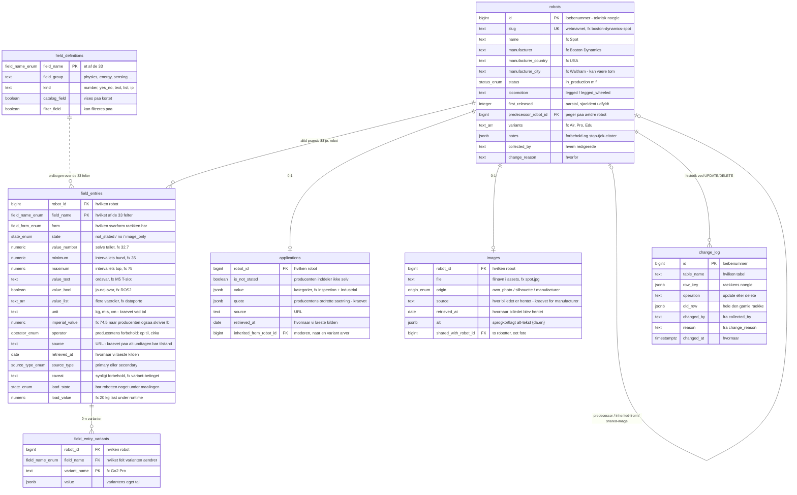

## ER-diagrammet

Opdateret 2. sep 2026 (spor/skema, L81-L83 — engelsk skema, 33 felter,
`change_log` i stedet for `synk_aftryk`). Se [DIAGRAM.md](DIAGRAM.md) for
den fulde, forklarede udgave med enum-tabeller og tabelbeskrivelser — denne
fil er kun selve diagrammet, til hurtigt opslag.

