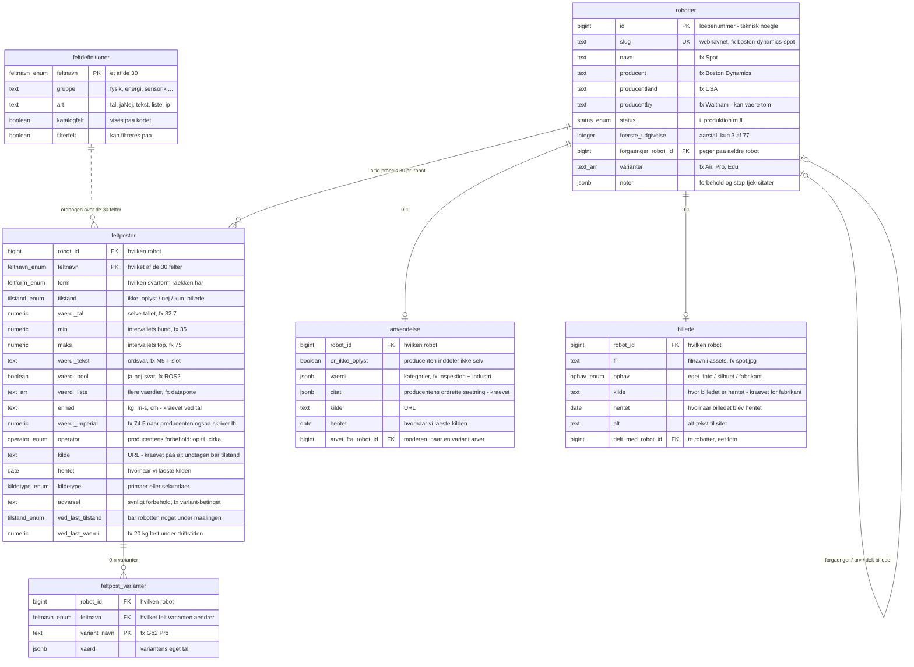

## ER-diagrammet

```mermaid
erDiagram
  robotter ||--o{ feltposter : "altid praecis 30 pr. robot"
  feltposter ||--o{ feltpost_varianter : "0-n varianter"
  robotter ||--o| anvendelse : "0-1"
  robotter ||--o| billede : "0-1"
  robotter |o--o| robotter : "forgaenger / arv / delt billede"
  feltdefinitioner ||..o{ feltposter : "ordbogen over de 30 felter"

  robotter {
    bigint id PK "loebenummer - teknisk noegle"
    text slug UK "webnavnet, fx boston-dynamics-spot"
    text navn "fx Spot"
    text producent "fx Boston Dynamics"
    text producentland "fx USA"
    text producentby "fx Waltham - kan vaere tom"
    status_enum status "i_produktion m.fl."
    integer foerste_udgivelse "aarstal, kun 3 af 77"
    bigint forgaenger_robot_id FK "peger paa aeldre robot"
    text_arr varianter "fx Air, Pro, Edu"
    jsonb noter "forbehold og stop-tjek-citater"
  }
  feltposter {
    bigint robot_id FK "hvilken robot"
    feltnavn_enum feltnavn PK "hvilket af de 30 felter"
    feltform_enum form "hvilken svarform raekken har"
    tilstand_enum tilstand "ikke_oplyst / nej / kun_billede"
    numeric vaerdi_tal "selve tallet, fx 32.7"
    numeric min "intervallets bund, fx 35"
    numeric maks "intervallets top, fx 75"
    text vaerdi_tekst "ordsvar, fx M5 T-slot"
    boolean vaerdi_bool "ja-nej-svar, fx ROS2"
    text_arr vaerdi_liste "flere vaerdier, fx dataporte"
    text enhed "kg, m-s, cm - kraevet ved tal"
    numeric vaerdi_imperial "fx 74.5 naar producenten ogsaa skriver lb"
    operator_enum operator "producentens forbehold: op til, cirka"
    text kilde "URL - kraevet paa alt undtagen bar tilstand"
    date hentet "hvornaar vi laeste kilden"
    kildetype_enum kildetype "primaer eller sekundaer"
    text advarsel "synligt forbehold, fx variant-betinget"
    tilstand_enum ved_last_tilstand "bar robotten noget under maalingen"
    numeric ved_last_vaerdi "fx 20 kg last under driftstiden"
  }
  feltpost_varianter {
    bigint robot_id FK "hvilken robot"
    feltnavn_enum feltnavn FK "hvilket felt varianten aendrer"
    text variant_navn PK "fx Go2 Pro"
    jsonb vaerdi "variantens eget tal"
  }
  anvendelse {
    bigint robot_id FK "hvilken robot"
    boolean er_ikke_oplyst "producenten inddeler ikke selv"
    jsonb vaerdi "kategorier, fx inspektion + industri"
    jsonb citat "producentens ordrette saetning - kraevet"
    text kilde "URL"
    date hentet "hvornaar vi laeste kilden"
    bigint arvet_fra_robot_id FK "moderen, naar en variant arver"
  }
  billede {
    bigint robot_id FK "hvilken robot"
    text fil "filnavn i assets, fx spot.jpg"
    ophav_enum ophav "eget_foto / silhuet / fabrikant"
    text kilde "hvor billedet er hentet - kraevet for fabrikant"
    date hentet "hvornaar billedet blev hentet"
    text alt "alt-tekst til sitet"
    bigint delt_med_robot_id FK "to robotter, eet foto"
  }
  feltdefinitioner {
    feltnavn_enum feltnavn PK "et af de 30"
    text gruppe "fysik, energi, sensorik ..."
    text art "tal, jaNej, tekst, liste, ip"
    boolean katalogfelt "vises paa kortet"
    boolean filterfelt "kan filtreres paa"
  }
```
